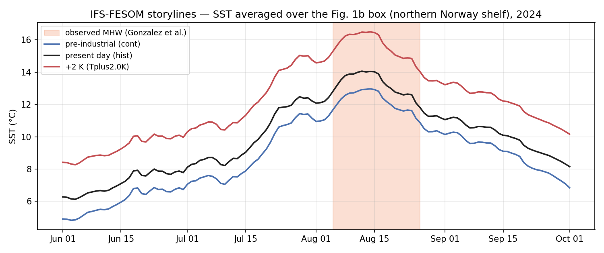
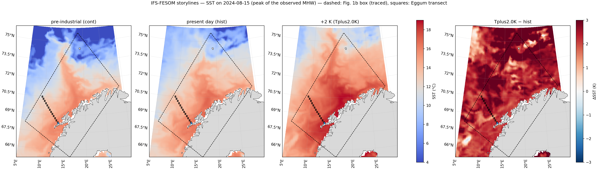
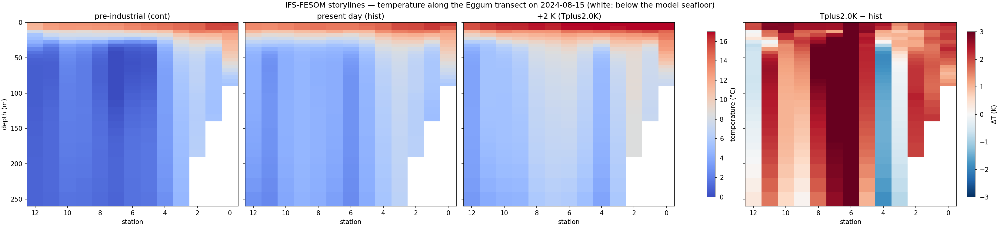

# Marine heatwave, northern Norway, August 2024: DestinE storylines

How the August 2024 marine heatwave (MHW) off Lofoten and Vesterålen looks in the Climate DT
storyline simulations, and how it would have looked in a pre-industrial and in a +2 K climate.
The figures follow Fig. 1 of

> Gonzalez, S., Sandvik, A. D., Haanæs, Ø. R. et al. (2025): Drivers of the summer 2024 marine
> heatwave and record salmon lice outbreak in northern Norway. *Commun. Earth Environ.* 6, 639.
> https://www.nature.com/articles/s43247-025-02618-1

In that paper (NorKyst model), the MHW ran from about 5 to 26 August 2024 and peaked on 15 August.
The box-mean SST was about 14 °C, against a 2012–2023 climatology of about 11.5 °C, and the warm
layer was only 30–40 m deep. It was driven by the atmosphere: weak winds, clear skies and a
record-high NAO.

## Data

**Storylines**, all three climates:

- model IFS-FESOM, `activity=story-nudging`, `stream=clte`
- `experiment` = `cont` (pre-industrial), `hist` (present day) or `Tplus2.0K` (+2 K)
- the atmosphere is nudged towards the observed weather; the ocean is free-running
- ocean on the FESOM NG5 mesh, the same as in the multi-decadal Climate DT runs
- requested with `resolution=high`; for storylines that is HEALPix nside 512 output
- storyline data cover 2017–2024

Variables:

| Variable | `levtype` | Frequency | Description |
|---|---|---|---|
| `avg_tos` | `o2d` | daily mean | sea surface temperature, K |
| `avg_thetao` | `o3d` | daily mean | sea water potential temperature, K |

`levelist` for `avg_thetao` is the FESOM level index. Levels 1–35 cover 0–300 m: 5 m steps down
to 100 m (level 20), then 10 m steps to 200 m (level 30), then 20 m steps to 300 m (level 35).
See the Climate DT user guide, *Data and Access → Ocean Model Levels*.

All requests are area requests with server-side regridding to a regular 0.05° grid (`area` +
`grid`). Polytope address `polytope.mn5.apps.dte.destination-earth.eu`, collection
`destination-earth`. Authentication: `desp-authentication.py` in the repository root (see
`README.md`).

## Running

From `climate-dt/explorer/vesteralen`, using the Polytope venv:

```bash
./run_mhw2024.sh
```

or one script at a time:

| Script | Figure | Requests |
|---|---|---|
| `mhw_fig1a_sst_timeseries.py` | `plots/mhw2024_fig1a_box_sst.png`: daily SST, box mean, 1 Jun – 1 Oct 2024 | 3 (one per climate) |
| `mhw_fig1b_sst_maps.py` | `plots/mhw2024_fig1b_sst_maps.png`: SST on 15 Aug 2024 and Tplus2.0K − hist | none, reads the cache from 1a |
| `mhw_fig1c_transect.py` | `plots/mhw2024_fig1c_eggum_transect.png`: 0–260 m along the Eggum transect, 15 Aug 2024 | 99 (33 levels × 3 climates) |

Each download is saved as NetCDF in `cache/` (gitignored), so a rerun with a full cache doesn't
send any new requests. 1a needs about a minute; 1c about 8–10 minutes. Settings (dates, box,
transect, levels) are in `mhw_common.py`.

### Exact requests

1a/1b, one per experiment (`cont`, `hist`, `Tplus2.0K`):

```yaml
class: d1
dataset: climate-dt
activity: story-nudging
experiment: hist            # cont / hist / Tplus2.0K
generation: '2'
model: IFS-FESOM
realization: '1'
resolution: high
expver: '0001'
stream: clte
type: fc
levtype: o2d
param: avg_tos
date: 20240601/to/20241001
time: '0000'
area: 76.0/5.0/65.0/29.5
grid: 0.05/0.05
```

1c, one per experiment and level (`levelist` 1 to 33):

```yaml
class: d1
dataset: climate-dt
activity: story-nudging
experiment: hist            # cont / hist / Tplus2.0K
generation: '2'
model: IFS-FESOM
realization: '1'
resolution: high
expver: '0001'
stream: clte
type: fc
levtype: o3d
param: avg_thetao
levelist: '1'               # 1 ... 33
date: '20240815'
time: '0000'
area: 70.8/9.0/68.1/14.0
grid: 0.05/0.05
```

The same request without the explorer, with plain earthkit:

```python
import earthkit.data
request = {...}   # one of the requests above, as a dict
data = earthkit.data.from_source("polytope", "destination-earth", request,
                                 address="polytope.mn5.apps.dte.destination-earth.eu", stream=False)
ds = data.to_xarray()
```

The scripts send these requests through the explorer's `PolytopeZarrStore`
(`ds[var].polytope.sel(climate=..., time=..., area=..., grid=..., level=...)`). That's the same
call as the daily ocean store and storyline cells in `04_lazy_browse_portfolio_hourly.ipynb`.

### Region and transect

- **Box**: the dashed area in Fig. 1b, traced by eye from the published map, so it's
  approximate. Corners (lat, lon): (68.26, 5.94), (65.32, 16.41), (71.22, 28.87), (75.66, 18.54).
  The box mean is area weighted (cos lat) over ocean points only; land is NaN in the model.
- **Transect**: 13 stations on a straight line from just off Eggum (68.36°N 13.55°E, station 0)
  to 70.48°N 9.45°E (station 12), also traced from Fig. 1b. The 0.05° fields are sampled at the
  nearest grid point.

## First results

These are absolute temperatures, without a baseline yet, compared by eye with Fig. 1 of the
paper.

**Box-mean SST (Fig. 1a)**



| Storyline climate | June mean | Peak | 15 Aug |
|---|---|---|---|
| `cont` (pre-industrial) | 5.98 °C | 12.97 °C (14 Aug) | 12.93 °C |
| `hist` (present day) | 7.14 °C | 14.07 °C (12 Aug) | 14.03 °C |
| `Tplus2.0K` (+2 K) | 9.31 °C | 16.50 °C (14 Aug) | 16.46 °C |

- **The event is there in `hist`.** The steep rise in early August, the plateau around 14 °C over
  8–16 August and the decline after about 20 August all follow the NorKyst curve, and the peak is
  almost the same (about 14 °C). Outside the event, `hist` runs about 1 °C below NorKyst: 6.3
  against about 7 °C on 1 June, and 8.1 against about 9.6 °C on 1 October.
- **The same weather in other climates:** at the peak, about 1.1 °C cooler pre-industrial and
  about 2.4 °C warmer at +2 K. At +2 K the box mean stays above 16 °C for about a week. That is
  the upper limit of the optimum range for Atlantic salmon given in the aquaculture infographic.

**SST map, 15 August (Fig. 1b)**



The warm tongue along the coast from Helgeland to Troms has the same shape as in NorKyst. The
largest Tplus2.0K − hist values on the map (up to +10.9 K) are in the Gulf of Bothnia, outside
the box.

**Eggum transect, 15 August (Fig. 1c)**



- **The vertical structure matches.** In `hist` there is 13–16 °C water at the surface over
  3–5 °C water below about 50 m. The warm water goes deeper only near the coast: down to 60–80 m
  at stations 0–1. The model seafloor drops from about 90 m (station 0) to 190 m (station 2),
  close to the NorKyst section.
- **The warm layer is thinner than in NorKyst.** The 12 °C water reaches only 10–15 m depth
  offshore in `hist`. In Fig. 1c the warm layer is 30–40 m thick.
- **At +2 K** the top 30 m are 1.9 K warmer. The 12 °C water reaches 15–25 m offshore and 40 m
  near the coast, so systems in the 10–50 m range (D) would see much more of the heat.
- **Below 50 m** the Tplus2.0K − hist difference varies a lot from station to station (about
  −1.5 to +3 K), because the ocean isn't nudged and each climate has its own eddies. Means over
  the event period are more robust; that's the next step.

## Next

- Depth–time sections (levels 1–35) at Eggum and off Vesterålen for July–September, and days
  above 16 °C and 18 °C in each depth band of the system types A–F (levels in `mhw_common.py`).
- Baseline for Fig. 1a. Two options: storyline `hist` 2017–2023, or the free-running IFS-FESOM
  high-res `hist` (2012–2014) + `SSP3-7.0` (2015–2023), which matches the paper's 2012–2023 period.
- Observations: OSTIA / Copernicus Marine SST maps, ERA5 for the atmosphere, observed profiles,
  and BarentsWatch farm temperatures and lice counts. Every access step will be documented here.
