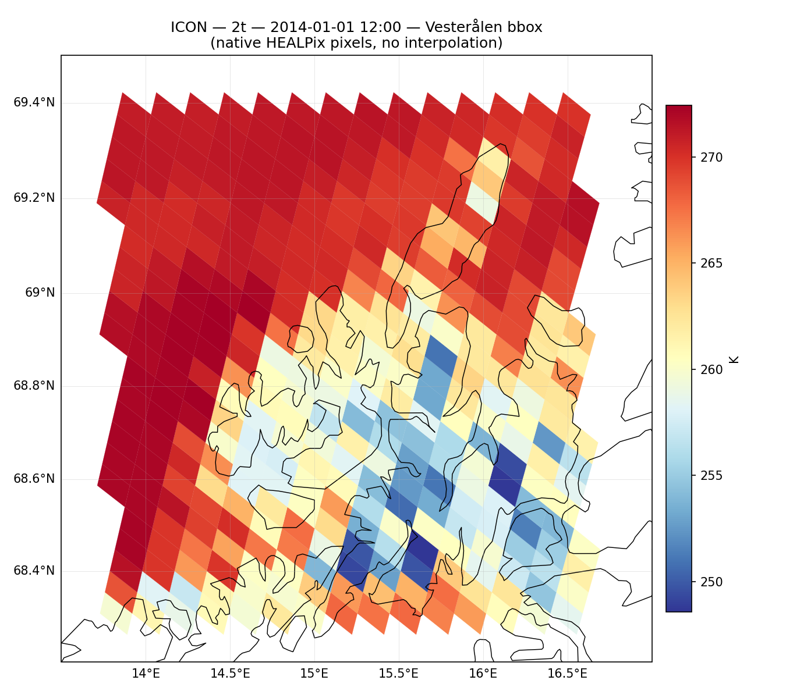
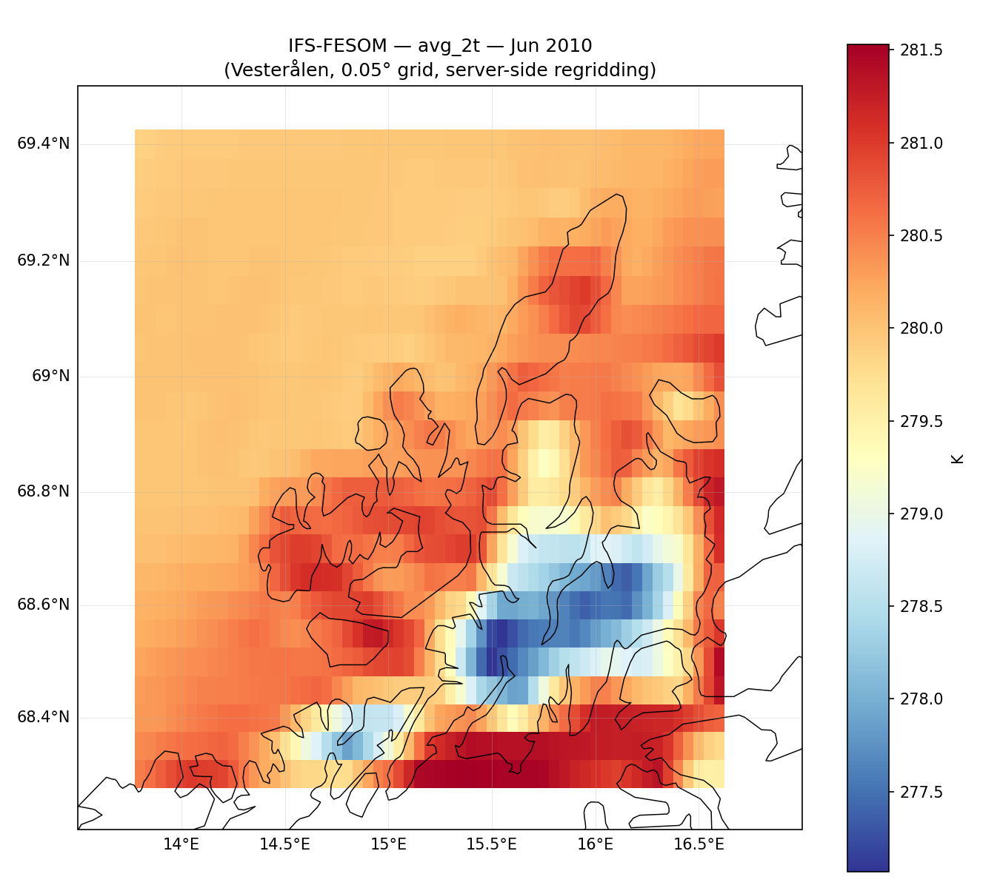
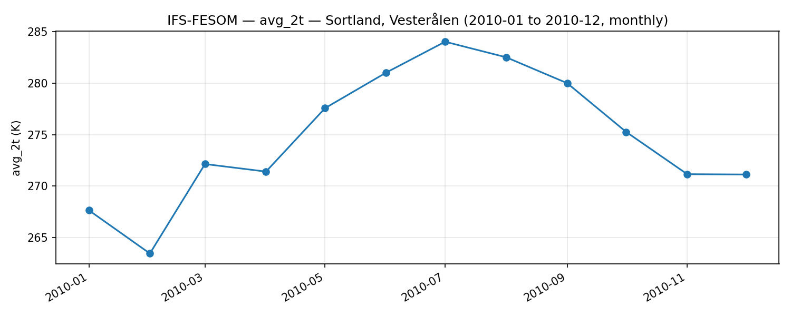

# Vesterålen plots

Local plots of Climate DT 2 m temperature over Vesterålen, Norway, pulled with the
explorer's `PolytopeZarrStore` (`../polytope_zarr.py`). They are the same requests as in
`03_lazy_browse_portfolio.ipynb` and `04_lazy_browse_portfolio_hourly.ipynb`, but over
Vesterålen instead of Germany, and as plain scripts so they can be rerun quickly.

## Setup

You need Python 3.10 or newer and a DestinE (DESP) account with Climate DT access.

From the repository root:

```bash
python3 -m venv .venv
.venv/bin/pip install -r climate-dt/requirements.txt
.venv/bin/python desp-authentication.py   # asks for DESP username/password, writes ~/.polytopeapirc
```

The key expires after a while. If you get `HTTP CLIENT ERROR (401)`, run
`desp-authentication.py` again.

## Running

```bash
cd climate-dt/explorer/vesteralen
./run_all.sh                     # all 8 plots, takes about a minute
```

Or run a single plot. Every script uses monthly means (`clmn`) by default; add `--hourly`
for the hourly stream (`clte`):

```bash
../../../.venv/bin/python plot_bbox_healpix.py
../../../.venv/bin/python plot_area_regridded.py --hourly
```

`run_all.sh` uses `.venv` in the repository root by default. To use another interpreter,
set `PYTHON=/path/to/python`.

PNGs are written to `plots/`. The first run downloads the Natural Earth 10m coastlines
through cartopy.

| Script | Request | Output |
|---|---|---|
| `plot_bbox_healpix.py` | Polytope `boundingbox` feature | native HEALPix cells in the box |
| `plot_polygon_healpix.py` | Polytope `polygon` feature | native HEALPix cells inside the Vesterålen outline |
| `plot_area_regridded.py` | MARS `area` + `grid=0.05/0.05` | field regridded on the server to a regular lat/lon grid |
| `plot_point_timeseries.py` | Polytope `timeseries` feature | 2 m temperature at Sortland |

The settings shared by all scripts (box, outline, Sortland coordinates, model, dates) are in
`vesteralen_common.py`. The outline is drawn by hand around Andøya, Langøya, Hadseløya and
the northern and western part of Hinnøya, so it is approximate. To use all of Norway instead,
replace `SHAPES` with `earthkit.geo.cartography.country_polygons(["Norway"], resolution=50e6)`.

All requests use the high-resolution store (nside 1024, about 4.4 km). The notebooks use
standard resolution for some cells; the scripts never do.

Default cases (same as the notebooks):

- monthly: IFS-FESOM, `avg_2t`, June 2010 (timeseries: all of 2010)
- hourly: ICON, `2t`, 2014-01-01 12:00 (timeseries: IFS-NEMO, 1–2 January 2014)

The maps use the Mercator projection. With PlateCarree, a region at 69°N looks stretched
east–west by about a factor of 3.

## What the plots show

**Native HEALPix (bbox / polygon).** High resolution is nside 1024, which is about 4.4 km.
That gives 345 cells for the box and 243 cells inside the outline. At this latitude the cells
are visibly skewed diamonds. They are plotted as-is, without any interpolation.



**Server-side regridding (area).** The same field interpolated by the server to 0.05°, which
gives a 23 × 57 grid. At 69°N, 0.05° of longitude is only about 2 km, so the grid is finer in
longitude than the model grid. It's convenient for further processing, but it doesn't add any
detail.



**Point timeseries (Sortland).** The value of the high-resolution cell at Sortland.



## First findings

These are first impressions from single dates, not a proper evaluation.

- **The orography shows up clearly at 4.4 km.** In June 2010 (IFS-FESOM monthly mean), the
  sea and the low coastal areas are at about 280–281.5 K (7–8 °C). The mountains on Hinnøya
  stay around 277 K (about 4 °C), and that cold patch follows the terrain closely.
- **The land–sea contrast in winter is strong.** At noon on 1 January 2014 (ICON), the open
  sea west of the islands is at about 271–272 K. Inland on Langøya and Hinnøya it drops to
  about 249 K (−24 °C). Andøya and the outer coast are somewhere in between.
- **Sortland stays mild in IFS-NEMO.** On 1–2 January 2014, IFS-NEMO gives 271.5–277.5 K at
  Sortland, so mostly just above freezing. Sortland is on the coast, but the gap to ICON's cold
  inland cells on the same day is large. It's worth comparing the models at the same point
  before reading much into it.
- **The seasonal cycle at Sortland** (IFS-FESOM 2010, monthly means) runs from about 263.5 K in
  February to 284 K in July, roughly −10 °C to +11 °C. As a quick check, the standard-resolution
  store gives a noticeably flatter cycle there, about 268–283 K, because its ~50 km cell is
  mostly sea.

## Notes

- The scripts import `polytope_zarr` from the parent folder, so keep them inside
  `climate-dt/explorer/`.
- To change the case (another model, variable or date), edit `CONFIG` in
  `vesteralen_common.py`.
- Hourly `area` requests fetch the whole day and the script plots 12:00 from it, the same as
  notebook 04.
