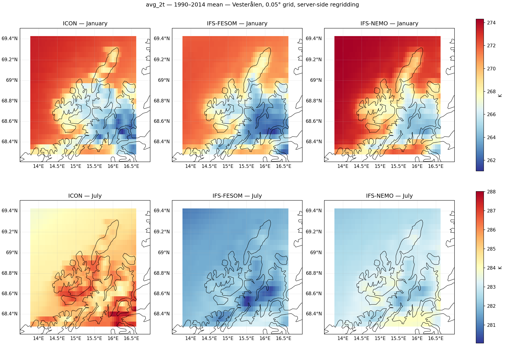
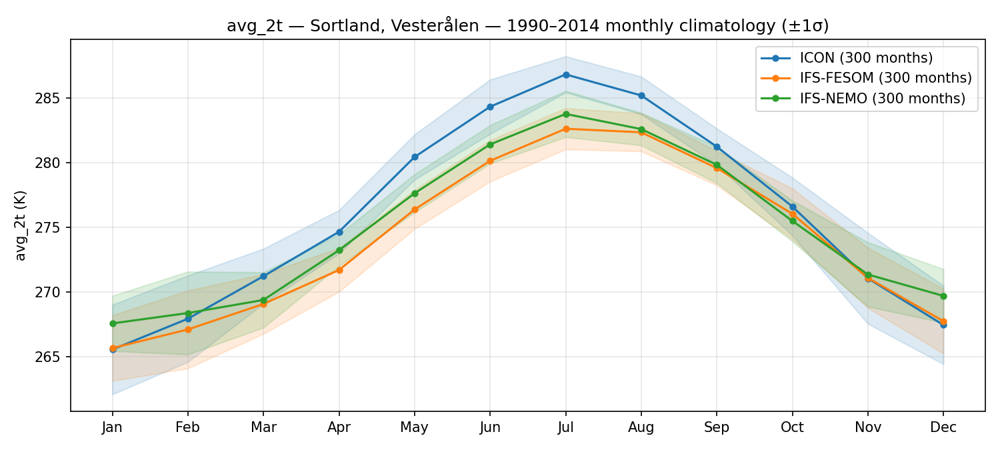

# Vesterålen plots

Local plots of Climate DT 2 m temperature over Vesterålen, Norway, pulled with the
explorer's `PolytopeZarrStore` (`../polytope_zarr.py`). They are the same requests as in
`03_lazy_browse_portfolio.ipynb` and `04_lazy_browse_portfolio_hourly.ipynb`, but over
Vesterålen instead of Germany, and as plain scripts so they can be rerun quickly.

## Setup

You need Python 3.10 or newer and a DestinE (DESP) account with Climate DT access.

From the repository root:

```bash
python3 -m venv .venv
.venv/bin/pip install -r climate-dt/requirements.txt
.venv/bin/python desp-authentication.py   # asks for DESP username/password, writes ~/.polytopeapirc
```

The key expires after a while. If you get `HTTP CLIENT ERROR (401)`, run
`desp-authentication.py` again.

## Running

```bash
cd climate-dt/explorer/vesteralen
./run_all.sh                     # all 10 plots, takes a few minutes
```

Or run a single plot. The four single-date scripts use monthly means (`clmn`) by default;
add `--hourly` for the hourly stream (`clte`):

```bash
../../../.venv/bin/python plot_bbox_healpix.py
../../../.venv/bin/python plot_area_regridded.py --hourly
```

`run_all.sh` uses `.venv` in the repository root by default. To use another interpreter,
set `PYTHON=/path/to/python`.

PNGs are written to `plots/`. The first run downloads the Natural Earth 10m coastlines
through cartopy.

| Script | Request | Output |
|---|---|---|
| `plot_bbox_healpix.py` | Polytope `boundingbox` feature | native HEALPix cells in the box |
| `plot_polygon_healpix.py` | Polytope `polygon` feature | native HEALPix cells inside the Vesterålen outline |
| `plot_area_regridded.py` | MARS `area` + `grid=0.05/0.05` | regridded field, ICON / IFS-FESOM / IFS-NEMO side by side |
| `plot_point_timeseries.py` | Polytope `timeseries` feature | 2 m temperature at Sortland, all three models |
| `plot_area_climatology.py` | `area` + `grid`, 1990–2014 | January and July means, all three models |
| `plot_point_climatology.py` | `timeseries`, 1990–2014 | seasonal cycle at Sortland (±1σ), all three models |

The two regridding scripts also print land and sea means for each model. The land/sea split uses the Natural Earth 10m land polygons.

The settings shared by all scripts (box, outline, Sortland coordinates, model, dates) are in
`vesteralen_common.py`. The outline is drawn by hand around Andøya, Langøya, Hadseløya and
the northern and western part of Hinnøya, so it is approximate. To use all of Norway instead,
replace `SHAPES` with `earthkit.geo.cartography.country_polygons(["Norway"], resolution=50e6)`.

All requests use the high-resolution store (nside 1024, about 4.4 km). The notebooks use
standard resolution for some cells; the scripts never do.

Default cases (dates as in the notebooks):

- monthly: `avg_2t`, June 2010 (timeseries: all of 2010). The HEALPix plots use IFS-FESOM.
- hourly: `2t`, 2014-01-01 12:00 (timeseries: 1–2 January 2014). The HEALPix plots use ICON.
- climatologies: `avg_2t` monthly means, 1990–2014, historical runs.

The maps use the Mercator projection. With PlateCarree, a region at 69°N looks stretched
east–west by about a factor of 3.

## What the plots show

**Native HEALPix (bbox / polygon).** High resolution is nside 1024, which is about 4.4 km.
That gives 345 cells for the box and 243 cells inside the outline. At this latitude the cells
are visibly skewed diamonds. They are plotted as-is, without any interpolation.


**Server-side regridding (area).** The field interpolated by the server to 0.05°, which
gives a 23 × 57 grid. At 69°N, 0.05° of longitude is only about 2 km, so the grid is finer in
longitude than the model grid. It's convenient for further processing, but it doesn't add any
detail.

**Model comparison.** The historical runs are free-running, so on any given date each model has
its own weather. The single-date panels (`vesteralen_area_regridded_*.png`,
`vesteralen_point_timeseries_*.png`) mostly compare weather. Use the 1990–2014 climatologies
to compare the models themselves.





## First findings

Only 2 m temperature has been looked at so far, and nothing has been compared with
observations yet.

1990–2014 means, from the scripts' output (K):

| | Jan land | Jan sea | Jul land | Jul sea | Sortland Jan | Sortland Jul |
|---|---|---|---|---|---|---|
| ICON | 266.3 | 270.9 | 285.5 | 284.9 | 265.5 | 286.8 |
| IFS-FESOM | 265.5 | 270.3 | 281.8 | 281.8 | 265.7 | 282.6 |
| IFS-NEMO | 267.5 | 272.3 | 283.0 | 282.8 | 267.6 | 283.8 |

- **The land–sea pattern is almost the same in all three models.** In January the sea is about
  4.7–4.8 K warmer than the land in every model, and the cold interiors of Hinnøya and Langøya
  sit in the same places. At this output resolution, none of the models stands out for
  "resolving the sea" better. The differences are mostly offsets over the whole area.
- **IFS-NEMO is warmer than IFS-FESOM, over the sea and over land.** Both use the same IFS
  atmosphere, so the difference comes from the ocean side. IFS-NEMO is about 2 K warmer in
  January and about 1 K warmer in July. Worth checking SST and sea ice next (`avg_tos`,
  `avg_siconc`) to see whether NEMO keeps the Norwegian Sea warmer up there.
- **ICON has much warmer summers.** In July ICON is about 3–4 K warmer than IFS-FESOM, over
  both land and sea. At Sortland its seasonal cycle is about 21 K, compared with 16–17 K in the
  IFS runs. Its winters are no colder than IFS-FESOM, so the larger cycle comes almost entirely
  from the summer.
- **All three look cold in winter for a coastal site.** At Sortland, the January means are
  around 265.5–267.6 K (−7.5 to −5.5 °C). That seems low for the coast at this latitude. It
  should be checked against MET Norway station data or seNorge before drawing conclusions. The
  cell also includes some terrain and fjord, so it isn't a pure station-like point.
- **Orography shows up clearly at 4.4 km** in all models. The mountains on Hinnøya stand out as
  the coldest area in both seasons.
- **Bands along latitude rows.** There are sharp horizontal steps in the regridded fields (for
  example near 68.95°N and 68.35°N), and they appear in all three models. They look like an
  artefact of the HEALPix → 0.05° regridding rather than anything physical, but this hasn't
  been checked yet.

## Notes

- The scripts import `polytope_zarr` from the parent folder, so keep them inside
  `climate-dt/explorer/`.
- To change the case (variable or date), edit `CONFIG` in `vesteralen_common.py`. The models
  are in `MODELS`.
- Hourly `area` requests fetch the whole day and the script plots 12:00 from it, the same as
  notebook 04.
